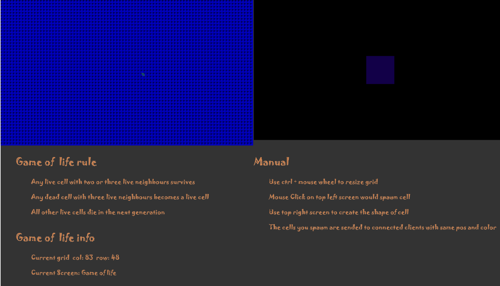

## 網頁說明

[Game of Life](https://zh.wikipedia.org/wiki/康威生命游戏)的網頁版

### 特色

畫面分成四個區塊 分別是 **Game of life**, **細胞創造**,**現在數據** 和 **使用說明**



##### Game of life

* 以websocket 讓客戶和客戶之間傳輸數據 在此區塊滑鼠點擊的位置 傳輸與在 **細胞創造**上一樣形狀的細胞 到各個連線的客戶
* 在此區塊滑鼠移動時 同樣以websocket傳輸資料 讓各個客戶看得到彼此的滑鼠

##### 細胞創造

* 點擊區塊內的方格 自訂要創造的細胞

## 技術手段

* 使用工具:[oak@v10.1.0 | Deno](https://deno.land/x/oak@v10.1.0) 和 [websocket@v0.1.3 | Deno](https://deno.land/x/websocket@v0.1.3) , [glMatrix](https://glmatrix.net/)

* 用canvas 內容中的webgl2 呈現畫面 

* 用glviewport把四個畫面逐一投影在不同位置和大小 

  ```javascript
  OnRender(){
  
      gl.clearColor(0.2,0.2,0.2,1.0);
  
      gl.clear(gl.COLOR_BUFFER_BIT|gl.DEPTH_BUFFER_BIT);
  
  
  
      for(let i = 0 ; i < this.m_Screens.length ; i++){
        //call each screen onRender function
        this.m_Screens[i].screen.OnRender();
  
      }
  
    }
  ```

  ```javascript
  // each screen
  OnRender(){
          //each screen is render on different pos
          gl.viewport(this.xPos,this.yPos,this.width,this.height);
      }
  ```

* Game Of Life 實作

  ```javascript
  //細胞
  class Cell{
    constructor(xPos,yPos,cellColor,state){
        this.data = [];
        this.data[0] = xPos;
        this.data[1] = yPos;
        this.OnSpawn(state,cellColor);
    }
  
    OnSpawn(state,cellColor){
        this.data[2] = cellColor[0];
        this.data[3] = cellColor[1];
        this.data[4] = cellColor[2];
        this.data[5] = cellColor[3];
        this.m_State = state;
    }
  }
  
  //創造存放細胞的二維正列
  function makeGrid(col,row,resolution,deadColor){
      let  arr = new Array(col);
      for(let i = 0 ; i <col ;i ++){
          arr[i] = new Array(row);
      }
      for(let i = 0 ; i < col ; i++){
          for(let j = 0 ; j < row; j++){
              arr[i][j] = new Cell(i * resolution, j * resolution,deadColor,0);
          }
      }
      return arr;
   }
  
   //update every frame
   gridUpdate(){
          //don't want to change state base on each iteration
          FillBlank(this.next,this.col,this.row,this.deadCellColor);
  
          for(let i = 0 ;  i < this.col; i ++){
              for(let j = 0 ; j < this.row ; j++){
                  let neighbors = this.CountNeighbors(i,j);
                  //rule
                  let state = this.grid[i][j].m_State;
                  // if this cell is alive and nearby cell is either less than two or more than three. die
                  if(state == 1 && (neighbors < 2||neighbors > 3)){
                      this.next[i][j].OnSpawn(0,this.deadCellColor);
                  }
                  // if this cell is deaad and nearby cell equal three. live
                  else if(state == 0 && neighbors == 3){
                      this.next[i][j].OnSpawn(1,this.newColor);
                  //else unchange
                  }else{
                      this.next[i][j].OnSpawn(state,
                          [this.grid[i][j].data[2],this.grid[i][j].data[3],this.grid[i][j].data[4],this.grid[i][j].data[5]]);
                  }
              }
        }
          //swap
          var swap = function (x){return x};
          this.grid = swap(this.next, this.next=this.grid);
   }
   CountNeighbors(i,j){
          this.newColor = [0,0,0,0];
          let aliveCount = 0;
          let col = 0;
          let row = 0;
          for(let k = -1  ; k < 2 ; k++){
              for(let z = -1  ; z < 2 ; z++){
                  col = (i + k + this.col) % this.col;
                  row = (j + z + this.row) % this.row;
                  if(this.grid[col][row].m_State == 1){
                      aliveCount++
                      this.MergeColor(3,[this.grid[col][row].data[2],this.grid[col][row].data[3],this.grid[col][row].data[4],this.grid[col][row].data[5]]);
                  };                       
              }
          }//don't count itself
          aliveCount -= this.grid[i][j].m_State;
          return aliveCount;
   }
  ```
* 資料傳輸

 &nbsp; 細胞傳輸:
  ```
  ```

* Cell Create 實作

    使用上面同樣的函式創造細胞們 並parse滑鼠位置到clip space選取現在點選的網格


## 參考資料

[fps](https://stackoverflow.com/questions/19764018/controlling-fps-with-requestanimationframe)
